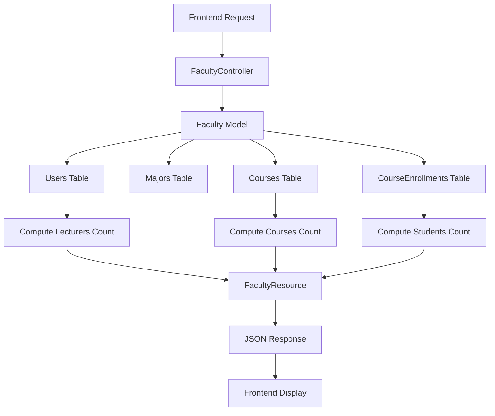

# Faculty Management API Implementation Plan

## Overview
This plan outlines the implementation of backend API endpoints for the Faculty Management (Manajemen Fakultas) feature, using the frontend mock data as the reference structure.

## Frontend Mock Data Analysis

### Data Structure (from `frontend/src/constants/mock-data.ts`)
```typescript
facultyData: [
  {
    id: 1,
    name: "Fakultas Teknik",
    code: "FT",
    dean: "Dr. Budi Santoso",
    students: 1250,
    courses: 45,
    lecturers: 85,
    lecturersList: [
      { id: 1, name: "Dr. Budi Santoso", role: "Dekan", email: "budi.santoso@univ.ac.id" },
      { id: 2, name: "Prof. Ahmad Wijaya", role: "Wakil Dekan", email: "ahmad.wijaya@univ.ac.id" },
      // ... more lecturers
    ]
  },
  // ... more faculties
]
```

### Key Fields Required:
- **Basic Info**: `id`, `name`, `code`, `dean` (dean_name)
- **Statistics**: `students`, `courses`, `lecturers` (computed)
- **Lecturers List**: Array of lecturer objects with `id`, `name`, `role`, `email`

## Backend Current State

### Existing Models
- **Faculty**: `id`, `name`, `code`, `dean_name`, `description`, `created_at`, `updated_at`
- **User**: `id`, `name`, `email`, `role`, `password`, etc. (no faculty_id)
- **Major**: `id`, `name`, `code`, `faculty_id`
- **Course**: `id`, `name`, `code`, `faculty_id`, `major_id`

### Existing Controllers
- `FacultyController`: Basic CRUD operations (index, store, show, update, destroy)

### Existing Resources
- `FacultyResource`: Returns basic faculty data

## Implementation Plan

### Step 1: Database Migration - Add faculty_id to Users Table
**File**: `backend/database/migrations/2025_12_30_000002_add_faculty_id_to_users_table.php`

**Purpose**: Link lecturers (users with role 'lecturer') to their respective faculties.

**Changes**:
- Add `faculty_id` column to `users` table
- Add foreign key constraint to `faculties` table
- Make it nullable (not all users belong to a faculty)

```php
Schema::table('users', function (Blueprint $table) {
    $table->foreignId('faculty_id')->nullable()->after('role')->constrained('faculties')->onDelete('set null');
});
```

### Step 2: Update User Model
**File**: `backend/app/Models/User.php`

**Changes**:
- Add `faculty()` relationship method
- Add scope to filter by faculty

```php
public function faculty()
{
    return $this->belongsTo(Faculty::class);
}

public function scopeByFaculty($query, $facultyId)
{
    return $query->where('faculty_id', $facultyId);
}
```

### Step 3: Update Faculty Model
**File**: `backend/app/Models/Faculty.php`

**Changes**:
- Add `users()` relationship to get lecturers
- Add `majors()` relationship (if not exists)
- Add `courses()` relationship (if not exists)
- Add computed attributes for statistics

```php
public function users()
{
    return $this->hasMany(User::class);
}

public function lecturers()
{
    return $this->hasMany(User::class)->where('role', 'lecturer');
}

public function majors()
{
    return $this->hasMany(Major::class);
}

public function courses()
{
    return $this->hasMany(Course::class);
}

public function getStudentsCountAttribute()
{
    // Count students enrolled in courses of this faculty
    return CourseEnrollment::whereIn('course_id', $this->courses()->pluck('id'))->count();
}

public function getCoursesCountAttribute()
{
    return $this->courses()->count();
}

public function getLecturersCountAttribute()
{
    return $this->lecturers()->count();
}
```

### Step 4: Update FacultyController
**File**: `backend/app/Http/Controllers/Api/FacultyController.php`

**Changes**:
- Modify `index()` to include statistics and lecturers
- Modify `show()` to include detailed information
- Add `getLecturers($facultyId)` method to fetch lecturers for a faculty

```php
public function index()
{
    $faculties = Faculty::with(['majors', 'lecturers'])->get();
    return FacultyResource::collection($faculties);
}

public function show($id)
{
    $faculty = Faculty::with(['majors', 'lecturers', 'courses'])->findOrFail($id);
    return new FacultyResource($faculty);
}

public function getLecturers($facultyId)
{
    $lecturers = User::where('faculty_id', $facultyId)
        ->where('role', 'lecturer')
        ->get();
    return UserResource::collection($lecturers);
}
```

### Step 5: Update FacultyResource
**File**: `backend/app/Http/Resources/FacultyResource.php`

**Changes**:
- Include computed statistics (students, courses, lecturers)
- Include lecturers list with required fields

```php
public function toArray($request)
{
    return [
        'id' => $this->id,
        'name' => $this->name,
        'code' => $this->code,
        'dean' => $this->dean_name,
        'description' => $this->description,
        'students' => $this->students_count,
        'courses' => $this->courses_count,
        'lecturers' => $this->lecturers_count,
        'lecturersList' => UserResource::collection($this->whenLoaded('lecturers')),
        'majors' => MajorResource::collection($this->whenLoaded('majors')),
        'created_at' => $this->created_at,
        'updated_at' => $this->updated_at,
    ];
}
```

### Step 6: Update FacultyMajorSeeder
**File**: `backend/database/seeders/FacultyMajorSeeder.php`

**Changes**:
- Update faculty data to match frontend mock data
- Ensure all 5 faculties from frontend are included

```php
$faculties = [
    [
        'name' => 'Fakultas Teknik',
        'code' => 'FT',
        'dean_name' => 'Dr. Budi Santoso',
        'description' => 'Fakultas yang berfokus pada pendidikan teknik dan teknologi',
    ],
    [
        'name' => 'Fakultas Ekonomi dan Bisnis',
        'code' => 'FEB',
        'dean_name' => 'Prof. Siti Aminah',
        'description' => 'Fakultas yang berfokus pada pendidikan ekonomi dan bisnis',
    ],
    [
        'name' => 'Fakultas Ilmu Komputer',
        'code' => 'FIK',
        'dean_name' => 'Dr. Hendra Gunawan',
        'description' => 'Fakultas yang berfokus pada pendidikan ilmu komputer dan teknologi informasi',
    ],
    [
        'name' => 'Fakultas Hukum',
        'code' => 'FH',
        'dean_name' => 'Prof. Rina Kartika',
        'description' => 'Fakultas yang berfokus pada pendidikan hukum',
    ],
    [
        'name' => 'Fakultas Kedokteran',
        'code' => 'FK',
        'dean_name' => 'Dr. Ahmad Fauzi',
        'description' => 'Fakultas yang berfokus pada pendidikan kedokteran',
    ],
];
```

### Step 7: Update UserSeeder
**File**: `backend/database/seeders/UserSeeder.php`

**Changes**:
- Add `faculty_id` to lecturer users
- Create lecturers matching frontend mock data structure

```php
// Example for Fakultas Teknik lecturers
User::create([
    'name' => 'Dr. Budi Santoso',
    'email' => 'budi.santoso@univ.ac.id',
    'role' => 'lecturer',
    'faculty_id' => 1, // Fakultas Teknik
    'password' => bcrypt('password'),
    // ... other fields
]);

User::create([
    'name' => 'Prof. Ahmad Wijaya',
    'email' => 'ahmad.wijaya@univ.ac.id',
    'role' => 'lecturer',
    'faculty_id' => 1, // Fakultas Teknik
    'password' => bcrypt('password'),
    // ... other fields
]);
```

### Step 8: Update API Routes
**File**: `backend/routes/api.php`

**Changes**:
- Add route for fetching faculty lecturers

```php
Route::get('/faculties/{faculty}/lecturers', [FacultyController::class, 'getLecturers']);
```

## API Endpoints

### 1. Get All Faculties
```
GET /api/faculties
```

**Response**:
```json
{
  "data": [
    {
      "id": 1,
      "name": "Fakultas Teknik",
      "code": "FT",
      "dean": "Dr. Budi Santoso",
      "description": "...",
      "students": 1250,
      "courses": 45,
      "lecturers": 85,
      "lecturersList": [...],
      "majors": [...]
    }
  ]
}
```

### 2. Get Faculty Details
```
GET /api/faculties/{id}
```

**Response**: Same as above but for single faculty

### 3. Get Faculty Lecturers
```
GET /api/faculties/{facultyId}/lecturers
```

**Response**:
```json
{
  "data": [
    {
      "id": 1,
      "name": "Dr. Budi Santoso",
      "email": "budi.santoso@univ.ac.id",
      "role": "lecturer"
    }
  ]
}
```

### 4. Create Faculty
```
POST /api/faculties
```

**Request Body**:
```json
{
  "name": "Fakultas Baru",
  "code": "FB",
  "dean_name": "Dr. New Dean",
  "description": "Description"
}
```

### 5. Update Faculty
```
PUT /api/faculties/{id}
```

### 6. Delete Faculty
```
DELETE /api/faculties/{id}
```

## Data Flow Diagram



## Implementation Order

1. ✅ Analyze frontend mock data and backend structure
2. ⏳ Create migration to add faculty_id to users table
3. ⏳ Update User model to include faculty relationship
4. ⏳ Update Faculty model to include users (lecturers) relationship
5. ⏳ Update FacultyController to compute and return stats
6. ⏳ Update FacultyResource to include stats and lecturers data
7. ⏳ Update FacultyMajorSeeder with data matching frontend mock data
8. ⏳ Update UserSeeder to include faculty_id for lecturers
9. ⏳ Test the API endpoints with frontend mock data structure
10. ⏳ Document the API endpoints for frontend integration

## Notes

- The `students` count is computed from `course_enrollments` where courses belong to the faculty
- The `courses` count is computed from the `courses` table filtered by faculty_id
- The `lecturers` count is computed from `users` table where role='lecturer' and faculty_id matches
- All statistics are computed dynamically to ensure accuracy
- The `lecturersList` includes all lecturers associated with the faculty